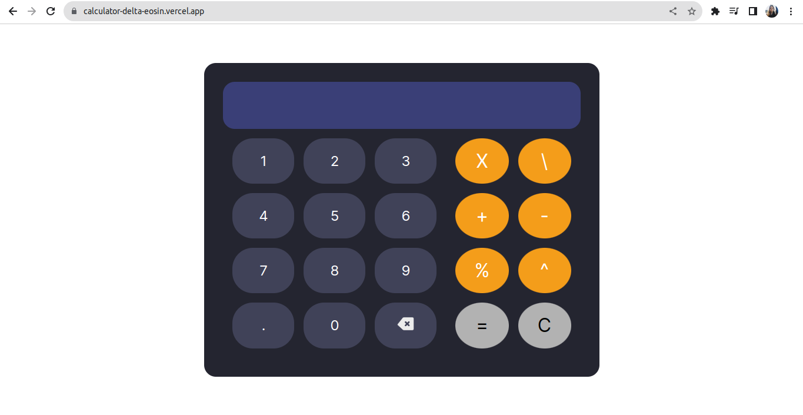
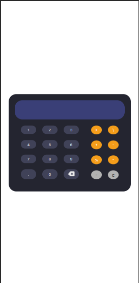

<h1 align="center">
     🧮 <a href="https://calculator-delta-eosin.vercel.app" alt="site da calculadora em javascript"> Calculadora em JavaScript </a>
</h1>
<h3 align="center">
    Uma calculadora desenvolvida em HTML, CSS e Javascript. 
</h3>

     
     
     
     
     

Índice
=================
<!--ts-->
- [Sobre o projeto](#sobre-o-projeto)
- [⚙️ Funcionalidades](#%EF%B8%8F-funcionalidades)
- [🛠️ Tecnologias](#%EF%B8%8F-tecnologias)
    + [**Website**](#website)
    + [**Utilitários**](#utilitários)
- [🎨 Layout](#-layout)
  * [Website para desktops.](#website-para-desktops)
  * [Website mobile.](#website-mobile)
- [🦸 Autor](#-autor)
- [📝 Licença](#-licença)
<!--te-->

## Sobre o projeto

O objetivo principal do projeto foi praticar conceitos da linguagem de programação JavaScript em aplicações web. 

---
## ⚙️ Funcionalidades

- [x] Realizar as operações matemáticas mais comuns:
  - [x] Adição.
  - [x] Subtração.
  - [x] Divisão.
  - [x] Multiplicação.
  - [x] Porcentagem.
  - [x] Potenciação.

- [x] Deletar caracteres individualmente.
- [x] Apagar todos os caracteres simultaneamente (limpar a tela).
- [x] Responsividade para dispositivos móveis (tablets e celulares).

 👀 As funcionalidades descritas podem ser testadas no site oficial do projeto. ➡️ Clique <a href="https://calculator-delta-eosin.vercel.app">aqui.⬅️ </a>

---

## 🛠️ Tecnologias

As seguintes tecnologias foram utilizadas no projeto:

#### **Website** 
- JavaScript (https://developer.mozilla.org/pt-BR/docs/Web/JavaScript)
     - Manipulação do DOM.
     - Métodos de array (includes, split, pop, join, forEach).
     - Objetos.
     - Validação de ações dos usuários.
     - Tratamento de erros.
- HTML (https://developer.mozilla.org/pt-BR/docs/Web/HTML).
- CSS (https://developer.mozilla.org/pt-BR/docs/Web/CSS).
     - Flexbox.
     - Media queries.
     - Estilização de maneira geral.
     - 
#### **Utilitários**

- Visual Studio Code (https://code.visualstudio.com/).
- Git e GitHub (https://git-scm.com/).

--- 
## 🎨 Layout

### Website para desktops.

### Website mobile.

     

## 🦸 Autor

George Alves de Araujo. 🚀

 

---

## 📝 Licença

Este projeto está sob a lincença [MIT](./LICENSE).

---

